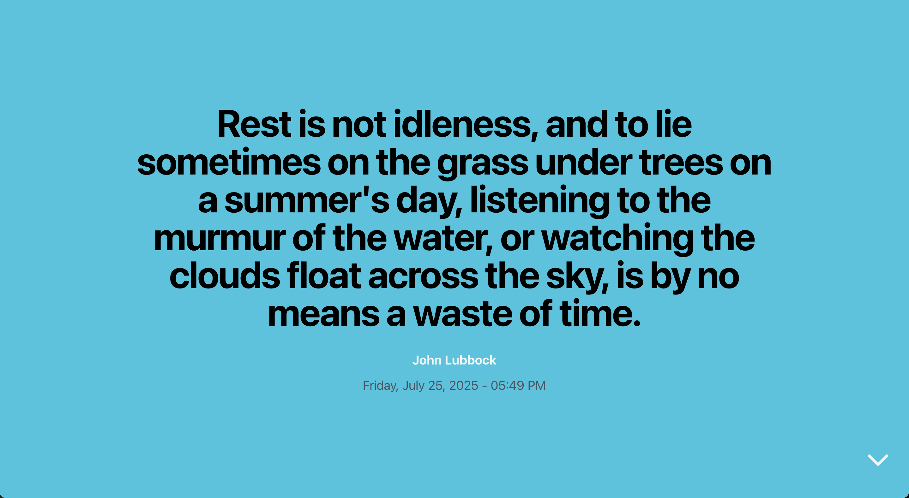

# RestFeed

RestFeed is a small web application that automatically displays quotes about leisure and holidays right when I'm about to shut down my computer — marking the end of the workday. It's a just-for-fun project to add a little joy when clocking out.

## Features

- Shows quotes about rest and free time.

- Automatically triggers when shutting down the computer (work in progress).

- Simple, minimalist interface for a calming experience.

- Simple backend to manage quotes: add, edit, and delete.

## Technologies Used

React (frontend), Node.js + Supabase (backend)

## 🎭 [RestFeed](https://rest-feed.vercel.app/)

## How to Use

- Clone the repository.

- Set up your Supabase environment variables + login details.

- Install dependencies with npm install.

- Run the app locally with npm run dev (frontend) and node index.js (backend)

- Log in and enjoy your personalized quotes.

## Next Steps

Improve shutdown detection to automatically show quotes on computer shutdown.